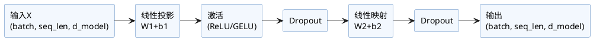

Transformer模型中，每一层都包含一个**前馈全连接网络（Feed Forward Network, FFN）**，又称为“前馈子层”。

## 1. FFN结构与原理

FFN对子层输入的每个位置，**独立进行同样的全连接映射和非线性变换**，核心结构如下：

- 两个线性变换（全连接层）+中间一个非线性激活函数。
- 通常输入输出维度一致（`d_model`），中间有一组更高的隐层维度（如`d_ff`）。

### 数学表达

$$
\text{FFN}(x) = \max(0, xW_1 + b_1) W_2 + b_2
$$

> 其中 $\max(0, \cdot)$ 为ReLU激活，可替换为GELU等，$W_1 \in \mathbb{R}^{d_{model} \times d_{ff}}$，$W_2 \in \mathbb{R}^{d_{ff} \times d_{model}}$。

## 2. 代码实现（PyTorch）

典型实现如下：

```python
import torch
import torch.nn as nn

class PositionwiseFeedForward(nn.Module):
    def __init__(self, d_model, d_ff, dropout=0.1):
        super().__init__()
        self.linear1 = nn.Linear(d_model, d_ff)
        self.activation = nn.ReLU()
        self.linear2 = nn.Linear(d_ff, d_model)
        self.dropout = nn.Dropout(dropout)

    def forward(self, x):
        # x形状: (batch, seq_len, d_model)
        x = self.linear1(x)
        x = self.activation(x)
        x = self.dropout(x)
        x = self.linear2(x)
        x = self.dropout(x)
        return x

# 示例用法
d_model = 512
d_ff = 2048
ffn = PositionwiseFeedForward(d_model, d_ff)
dummy_input = torch.randn(8, 20, d_model)  # 假设 batch=8, seq_len=20
output = ffn(dummy_input)  # output shape: (8, 20, d_model)
```

- `dropout`通常在两层之间和最后都加以防止过拟合。
- 激活函数可换为`nn.GELU`（BERT/最新LLM喜欢）。

## 3. FFN的作用&特征

- **作用**：对每个token作“独立非线性映射扩展”，增强模型表达能力。
- **特征**：
    - 不引入token之间的信息交互（全位置无关，单点处理）。
    - 截断、激活和缩放的作用，有助于信息混合与非线性表达。
    - 参数规模和计算占比不小于Attention子层。

## 4. 结构示意图



---

**小结:**  
前馈全连接层作为Transformer的“非线性变换工厂”，为每层注意力输出注入进一步的复杂性和表达力，是深层结构普适的组成部分。

---

