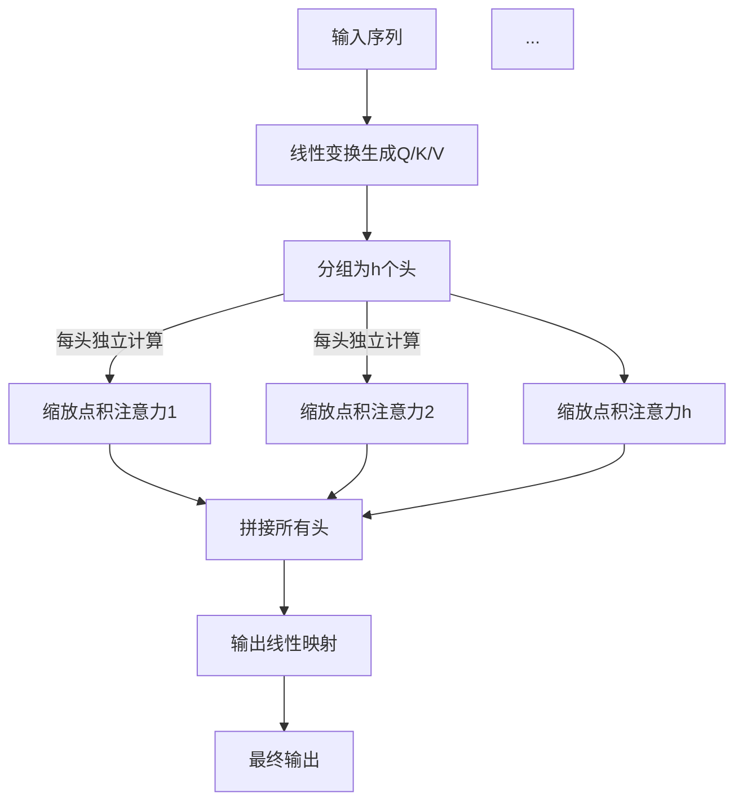

# Transformer之多头注意力机制（Multi-Head Attention）

多头注意力机制是Transformer架构的核心创新之一。它允许模型在不同的子空间中并行计算多组自注意力，从而捕捉序列不同维度、不同位置的丰富关系信息，大幅提升模型的表征能力与表达力。

---

## 1. 多头注意力机制原理

多头注意力（Multi-Head Attention，简称MHA）基本思想是：将输入的Q、K、V分别通过独立的线性变换分成$h$组（$h$个“头”），每个头在更低维子空间中执行自注意力计算。最后将各头输出拼接，再映射回原空间。

**公式描述：**

对于 $h$ 个头，每个头 $i$：

$$
\text{head}_i = \text{Attention}(Q W_i^Q,\, K W_i^K,\, V W_i^V)
$$

最终输出为：
$$
\text{MultiHead}(Q, K, V) = \text{Concat}(\text{head}_1, ..., \text{head}_h)\, W^O
$$

- $W_i^Q, W_i^K, W_i^V$：每一头独立的线性变换参数（通常 $d_k = d_v = d_{model}/h$）
- $W^O$：拼接后的输出线性映射回$d_{model}$维

---

## 2. 多头注意力结构图



---

## 3. PyTorch伪代码：自实现多头注意力

以下为典型的多头注意力核心实现代码（去除高级封装，易对照原理）：

```python
import torch
import torch.nn as nn
import torch.nn.functional as F

class MultiHeadAttention(nn.Module):
    def __init__(self, d_model, num_heads):
        super().__init__()
        assert d_model % num_heads == 0
        self.d_model = d_model
        self.num_heads = num_heads
        self.d_k = d_model // num_heads

        self.W_q = nn.Linear(d_model, d_model)
        self.W_k = nn.Linear(d_model, d_model)
        self.W_v = nn.Linear(d_model, d_model)
        self.W_o = nn.Linear(d_model, d_model)

    def forward(self, q, k, v, mask=None):
        # 输入q/k/v: (batch, seq_len, d_model)
        batch_size = q.size(0)
        Q = self.W_q(q).view(batch_size, -1, self.num_heads, self.d_k).transpose(1,2)  # (batch, heads, seq_len, d_k)
        K = self.W_k(k).view(batch_size, -1, self.num_heads, self.d_k).transpose(1,2)
        V = self.W_v(v).view(batch_size, -1, self.num_heads, self.d_k).transpose(1,2)

        # 计算Attention
        scores = Q @ K.transpose(-2, -1) / (self.d_k ** 0.5)  # (batch, heads, seq_len_q, seq_len_k)
        if mask is not None:
            scores = scores.masked_fill(mask == 0, float('-inf'))
        attn = F.softmax(scores, dim=-1)
        output = attn @ V  # (batch, heads, seq_len, d_k)

        # 合并所有头
        output = output.transpose(1,2).contiguous().view(batch_size, -1, self.d_model)
        output = self.W_o(output)  # (batch, seq_len, d_model)
        return output, attn
```

---

## 4. 多头机制的优势

- **并行多视角建模**：每个头专注输入的不同子空间，学习不同类型的相关性。
- **增强表征能力**：拼接多个头的attention输出，可复合多类信息。
- **全局依赖&局部模式兼容**：部分头专注全局，部分头关注局部模式。

---

## 5. 类比与实际应用

- 类似“多组专家/多个注意力聚焦”，每组关注不同token、区块、特征关系。
- 是Transformer结构泛化与性能跃升的关键。

---

## 6. 相关资料

- Vaswani et al. "Attention is All You Need" (2017)
- PyTorch官方 [torch.nn.MultiheadAttention](https://pytorch.org/docs/stable/generated/torch.nn.MultiheadAttention.html)
- [Jay Alammar: The Illustrated Transformer](http://jalammar.github.io/illustrated-transformer/)

---

