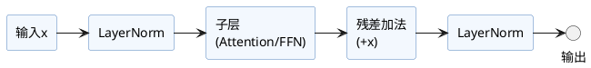

Transformer的**子层连接（Sublayer Connection）**，是编码器与解码器堆叠的基本结构单元。每一层通常包括如下模式：

- 每个子层（比如多头注意力、前馈FFN）前后组合**LayerNorm归一化**；
- 子层采用**残差连接**（Residual Connection）：输出 = 输入 + 子层处理后的结果；
- 常见两大结构模式：**Post-LN**（原论文）与**Pre-LN**（主流实现）。

---

## 1. 结构说明

- **残差连接**：直接将子层输入与输出相加，有助于缓解深层网络训练中的梯度消失/爆炸问题，促进信息流动。
- **归一化（LayerNorm）**：提升训练稳定性，加速收敛。常放在子层之前（Pre-LN）或之后（Post-LN）。

### 两种常用结构

1. **Post-LN（论文原版）**  
   归一化在“残差加法”后。  
   形式为：`x = LayerNorm(x + Sublayer(x))`

2. **Pre-LN（主流实践）**  
   归一化在“子层”前。  
   形式为：`x = x + Sublayer(LayerNorm(x))`

主流大模型基本采用Pre-LN结构。对比两者的差异，有助于理解模型训练与性能表现的改进点。

---

## 2. PyTorch示例（以Pre-LN为例）

```python
import torch.nn as nn

class TransformerBlock(nn.Module):
    def __init__(self, attn, ffn, d_model):
        super().__init__()
        self.attn = attn
        self.ffn = ffn
        self.norm1 = nn.LayerNorm(d_model)
        self.norm2 = nn.LayerNorm(d_model)

    def forward(self, x, mask=None):
        # x: (batch, seq_len, d_model)
        x = x + self.attn(self.norm1(x), mask)
        x = x + self.ffn(self.norm2(x))
        return x
```
*说明：先归一化（Pre-LN）再进子层，输出后直接做残差加法。*

---

## 3. 结构流程图

```plantuml
@startuml
skinparam rectangle {
  BackgroundColor #f3f8fe
  BorderColor #4f81bd
  Shadowing false
}
rectangle "输入x" as X
rectangle "LayerNorm" as Norm1
rectangle "子层\n(Attention/FFN)" as SubLayer
rectangle "残差加法\n(+x)" as Add
rectangle "LayerNorm" as Norm2

X -> Norm1
// ...


## Transformer之子层连接结构

子层连接（Sublayer Connection）是Transformer编码器和解码器堆叠的基本结构单元，其典型形式为：
- 每个子层（如多头注意力、前馈网络FFN）之前或之后都配有**LayerNorm归一化**；
- 每个子层采用**残差连接**（Residual Connection），即输入加子层输出；
- 最常用的两种结构：**Post-LN（原论文）**和**Pre-LN（主流实践）**。

---

### 1. 规范写法（Pre-LN版本）

```python
import torch.nn as nn

class TransformerBlock(nn.Module):
    def __init__(self, attn, ffn, d_model):
        super().__init__()
        self.attn = attn
        self.ffn = ffn
        self.norm1 = nn.LayerNorm(d_model)
        self.norm2 = nn.LayerNorm(d_model)

    def forward(self, x, mask=None):
        # x: (batch, seq_len, d_model)
        x = x + self.attn(self.norm1(x), mask)
        x = x + self.ffn(self.norm2(x))
        return x
```
*解释：先归一化再进子层（Pre-LN），残差加法后不再Norm。*

---

### 2. 结构流程图



---

### 3. 说明与扩展

- **残差连接**保证深层网络优化稳定、便于信息流传递。
- **LayerNorm归一化**（通常pre-LN）防止数值爆炸、改善梯度流。
- 子层包括**Self-Attention**和**Feed-Forward**，两者都采用上述连接模式。
- 新变体如**RMSNorm/ScaleNorm**可替换LayerNorm，推理/推断更高效。
- 此结构的可扩展性和训练稳定性是Transformer模型成功的基石。

---

**推荐阅读**  
- Vaswani et al., "Attention is All You Need" (2017)  
- Xiong et al., "On Layer Normalization in the Transformer Architecture" (arXiv:2002.04745)  
- [PyTorch nn.LayerNorm官方文档](https://pytorch.org/docs/stable/generated/torch.nn.LayerNorm.html)  

