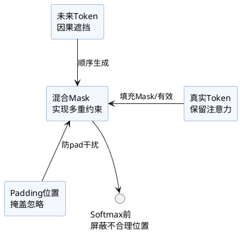

在Transformer结构中，**掩码张量（Mask Tensor）**是实现灵活序列处理、保序生成、忽略无效token的核心机制。常见掩码包括：
- Padding Mask（padding掩码）
- Attention/Causal Mask（自回归/因果掩码）
- Combined Mask（混合掩码）

本篇梳理其基本原理、典型代码实现与用途区别。

## 1. 为什么要用掩码？
1. **Padding Mask**：忽略输入序列中的pad（占位）token，避免对输出产生影响。
2. **Causal/Attention Mask**：Self-Attention时防止Decoder“看见未来”，保证自回归生成。
3. **应用场景**：翻译、对话、生成、序列对齐等。

## 2. 典型Mask构建代码

### 2.1 Padding Mask（序列padding位置掩码）

```python
import torch

def create_padding_mask(input_ids, pad_token_id=0):
    # input_ids: (batch, seq_len)
    return (input_ids == pad_token_id)  # True表明该位置是pad，形状: (batch, seq_len)
```

#### 应用示例：
```python
input_ids = torch.tensor([[3, 8, 5, 0, 0], [9, 1, 2, 4, 0]])  # 假设pad_token_id=0
padding_mask = create_padding_mask(input_ids)
# 输出: tensor([[False, False, False,  True,  True],
#             [False, False, False, False,  True]])
```

### 2.2 Causal Mask（保持生成顺序只看见历史）

常用于Decoder自注意力，让第i个token只能看到前i(含自身)的信息。

```python
def create_causal_mask(seq_len):
    # 返回形状：(seq_len, seq_len)，仅能"看到"自己及左侧
    mask = torch.triu(torch.ones(seq_len, seq_len), diagonal=1).bool()
    return mask  # True位置为不可见（需mask）
```

#### 应用示例：
```python
mask = create_causal_mask(4)
# tensor([[False,  True,  True,  True],
#         [False, False,  True,  True],
#         [False, False, False,  True],
#         [False, False, False, False]])
```

### 2.3 混合Mask用法

实际Self-Attention常结合两种mask，比如：
- (batch, 1, 1, seq_len)：广播兼容多头/多batch
- mask常用于 softmax前，将被mask区域赋为-1e9（或-inf）

#### 示例：

```python
attn_scores = ... # (batch, num_heads, seq_len_q, seq_len_k)
padding_mask = create_padding_mask(input_ids).unsqueeze(1).unsqueeze(2)  # (batch,1,1,seq_len)
causal_mask = create_causal_mask(seq_len=attn_scores.size(-1)).to(attn_scores.device)  # (seq_len, seq_len)

combined_mask = padding_mask | causal_mask  # 自动广播
# 被mask为True的地方设为极小值
attn_scores = attn_scores.masked_fill(combined_mask, -1e9)
attn_weights = torch.softmax(attn_scores, dim=-1)
```

## 3. 结构可视化



## 4. 小结

- Mask机制是Transformer训练与推理“可行性”的基础保障。
- 合理构建掩码，有效提升模型泛化和稳定性，确保结构语义合理。
- 多头、批量、多任务下注意掩码维度兼容和组合方式。
