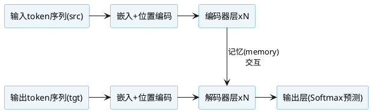

# Transformer模型完整构建（以编码器-解码器结构为例）

Transformer模型由编码器（Encoder）和解码器（Decoder）堆叠构成，整体结构见下：

```python
import torch.nn as nn

class Transformer(nn.Module):
    def __init__(self, vocab_size, d_model, num_encoder_layers, num_decoder_layers, nhead, d_ff, dropout=0.1):
        super().__init__()
        # 词嵌入和位置编码
        self.embedding = nn.Embedding(vocab_size, d_model)
        self.pos_encoding = PositionalEncoding(d_model, dropout)
        
        # 堆叠多个EncoderLayer
        self.encoder_layers = nn.ModuleList([
            EncoderLayer(d_model, nhead, d_ff, dropout) for _ in range(num_encoder_layers)
        ])

        # 堆叠多个DecoderLayer
        self.decoder_layers = nn.ModuleList([
            TransformerDecoderLayer(d_model, nhead, d_ff, dropout) for _ in range(num_decoder_layers)
        ])

        # 输出映射到词表
        self.proj = nn.Linear(d_model, vocab_size)

    def encode(self, src, src_mask=None):
        x = self.embedding(src) + self.pos_encoding(src)
        for layer in self.encoder_layers:
            x = layer(x, mask=src_mask)
        return x

    def decode(self, tgt, memory, tgt_mask=None, memory_mask=None):
        x = self.embedding(tgt) + self.pos_encoding(tgt)
        for layer in self.decoder_layers:
            x = layer(x, memory, self_mask=tgt_mask, cross_mask=memory_mask)
        return x

    def forward(self, src, tgt, src_mask=None, tgt_mask=None, memory_mask=None):
        memory = self.encode(src, src_mask)
        out = self.decode(tgt, memory, tgt_mask, memory_mask)
        logits = self.proj(out)
        return logits
```

- `EncoderLayer`见编码器层章节，`TransformerDecoderLayer`见解码器层章节。
- `PositionalEncoding`一般采用sin/cos或可学习位置编码。
- 输入张量通常为(batch, seq_len)的token索引。
- mask用于掩盖padding或因果推理需求。

---

## 结构总览图



---

**典型流程：**
1. 输入序列src/tgt分别经过嵌入和位置编码。
2. src侧堆叠多层EncoderLayer，输出记忆矩阵memory。
3. tgt侧堆叠多层DecoderLayer，解码时可访问memory（经cross attention交互）。
4. 输出经过线性映射得vocab维logits, 再做softmax即可生成目标序列。

---

**参考资料：**
- Vaswani et al. "Attention is All You Need" (2017)
- PyTorch官方[`nn.Transformer`](https://pytorch.org/docs/stable/generated/torch.nn.Transformer.html)
- Jay Alammar: [The Illustrated Transformer](http://jalammar.github.io/illustrated-transformer/)
