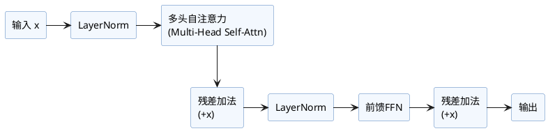

 Transformer编码器层（Encoder Layer）详解

Transformer编码器层是整个Encoder Block的基础单元，通常堆叠N层（如BERT-base为12层）。每一层典型结构如下：

1. **多头自注意力子层（Multi-Head Self-Attention）**
2. **残差连接+规范化（LayerNorm）**
3. **前馈全连接子层（Feed Forward）**
4. **再残差连接+规范化**

### 1. 公式及结构流程

设输入为 $X \in \mathbb{R}^{b\times n \times d_{model}}$，则单层Encoder可以表达为：

$$
\begin{align}
X' &= \text{LayerNorm}(X + \text{MultiHeadSelfAttn}(X)) \\\\
Y &= \text{LayerNorm}(X' + \text{PositionwiseFFN}(X'))
\end{align}
$$

**结构流程示意：**
- Input $\rightarrow$ Norm $\rightarrow$ SelfAttention $\rightarrow$ Add $\rightarrow$ Norm $\rightarrow$ FFN $\rightarrow$ Add $\rightarrow$ Output

### 2. 代码实现（PyTorch/伪代码）

```python
import torch.nn as nn

class EncoderLayer(nn.Module):
    def __init__(self, d_model, num_heads, d_ff, dropout=0.1):
        super().__init__()
        self.self_attn = MultiHeadAttention(d_model, num_heads)
        self.ffn = PositionwiseFeedForward(d_model, d_ff, dropout)
        self.norm1 = nn.LayerNorm(d_model)
        self.norm2 = nn.LayerNorm(d_model)
        self.dropout1 = nn.Dropout(dropout)
        self.dropout2 = nn.Dropout(dropout)
        
    def forward(self, x, mask=None):
        # x: (batch, seq_len, d_model)
        attn_output, _ = self.self_attn(x, x, x, mask)       # 自注意力
        x = x + self.dropout1(attn_output)                   # 残差加法1
        x = self.norm1(x)                                    # 归一化1

        ffn_output = self.ffn(x)                             # 前馈层
        x = x + self.dropout2(ffn_output)                    # 残差加法2
        x = self.norm2(x)                                    # 归一化2
        return x
```

- `MultiHeadAttention`和`PositionwiseFeedForward`请见对应章节详解。
- 上述为**Pre-LN结构**（归一化在子层**之前**，主流LLM采用）。
- 有些实现将Norm在残差**之后**（Post-LN），公式顺序有所不同。

### 3. 结构图



### 4. 补充说明

- 编码器层不是仅仅堆叠自注意力，而是每层都有独立参数和归一化。加深层数主要带来模型表达力提升。
- 常用**Pre-LN结构**，可以改善梯度流、加速训练收敛。
- **FeedForward/FFN层通常维度扩展4倍**（如BERT/Transformer经典架构 d_ff=4*d_model）。
- Dropout用于抑制过拟合，可插入每个子层输出及残差后。

---

**参考资料：**
- Vaswani et al. "Attention is All You Need" (2017)
- [PyTorch nn.TransformerEncoderLayer](https://pytorch.org/docs/stable/generated/torch.nn.TransformerEncoderLayer.html)
- [BERT代码实现（huggingface/transformers）](https://github.com/huggingface/transformers)
- Jay Alammar: [The Illustrated Transformer](http://jalammar.github.io/illustrated-transformer/)
