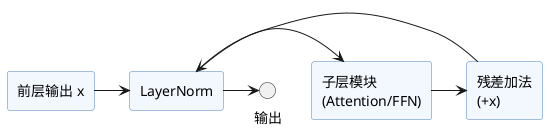

本文解析Transformer结构中的**规范化层（LayerNorm）**，其在深层网络中的作用、原理、典型实现方式，以及与BatchNorm等其他归一化方式的差异和选择。

---

## 1. 为什么需要规范化？

深层网络（如Transformer，多层堆叠）面临：

- 特征分布不断变化（内部协变量偏移）。
- 梯度消失或爆炸、收敛困难。
- 不同batch/sentence长度输入等带来训练稳定性挑战。

规范化层（Normalization）能有效缓解上述问题，提高训练效率和稳定性。

---

## 2. LayerNorm（层归一化）原理

### 2.1 计算公式

对输入 $X \in \mathbb{R}^{d_{model}}$，LayerNorm作用于最后一维：  
$$
\text{LayerNorm}(x) = \frac{x - \mu}{\sigma + \epsilon} \cdot \gamma + \beta
$$

- $\mu = \frac{1}{d_{model}} \sum_i x_i$（逐样本均值）
- $\sigma = \sqrt{\frac{1}{d_{model}}\sum_i(x_i-\mu)^2}$（逐样本标准差）
- $\gamma, \beta$为可学习缩放/平移参数
- $\epsilon$为数值稳定的微小正数

**特点：** 沿特征维归一化，对每个token独立，不依赖batch大小。

---

### 2.2 与BatchNorm的对比

|       | LayerNorm                 | BatchNorm                           |
|-------|---------------------------|-------------------------------------|
| 归一维度 | 每个样本的feature维         | batch维度（跨样本同一feature）       |
| 依赖batch | 否                        | 是                                  |
| RNN/自回归适用 | 是                    | 否                                  |
| 适合场景 | NLP，变长/小batch输入         | CV，大batch固定输入                  |

---

## 3. PyTorch中的LayerNorm实现

```python
import torch
import torch.nn as nn

# 假设输入x: (batch, seq_len, d_model)
d_model = 512
layer_norm = nn.LayerNorm(d_model)

x = torch.randn(16, 20, d_model) # batch=16, seq_len=20
out = layer_norm(x) # shape: (16, 20, d_model)
print(out.shape)
```

---

## 4. Transformer中的LayerNorm用法

- **子层后残差连接 + LayerNorm**：即 `Add & Norm`，对每个子模块输出加残差并LayerNorm。
- **常见顺序：**
    - 原始Transformer（Vaswani等, 2017）：`Sublayer(x) + x -> LayerNorm`
    - 预归一化（Pre-LN, 如GPT-2等）：`LayerNorm(x) -> Sublayer -> + x`

### 案例代码（pre-LN示意）

```python
class TransformerLayer(nn.Module):
    def __init__(self, d_model, self_attn, feed_forward):
        super().__init__()
        self.norm1 = nn.LayerNorm(d_model)
        self.attn = self_attn
        self.norm2 = nn.LayerNorm(d_model)
        self.ffn = feed_forward

    def forward(self, x, mask=None):
        # 前层输出 x: (batch, seq_len, d_model)
        x2 = self.attn(self.norm1(x), mask)
        x = x + x2
        x2 = self.ffn(self.norm2(x))
        x = x + x2
        return x
```
*注：实际attn/ffn实现可另见对应章节。*

---

## 5. 结构示意图



---

## 6. 小结与扩展

- LayerNorm为Transformer模型稳定训练的关键环节。
- 核心优势：对变长/小batch输入适用，打破CV时代BatchNorm的限制。
- 可扩展方案：RMSNorm等，去除均值更节省计算，部分LLM喜欢采用。
- 归一化放在残差前（pre-LN）还是后（post-LN）有实际性能/收敛差异，实际中常“Pre-LN优于Post-LN”。

---

**参考资料：**
- Vaswani et al., "Attention is All You Need" (2017)
- Ba et al., "Layer Normalization" (arXiv:1607.06450)
- [PyTorch nn.LayerNorm 文档](https://pytorch.org/docs/stable/generated/torch.nn.LayerNorm.html)
- GPT-2 Pre-LN架构讨论

