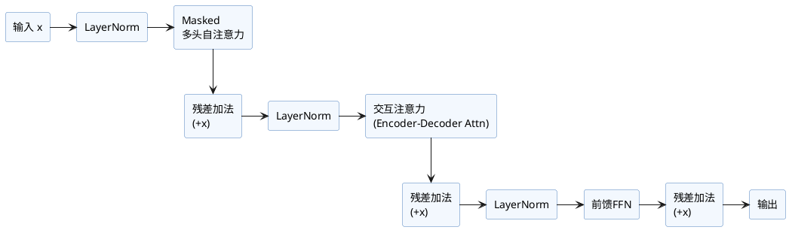

# Transformer解码器层（Decoder Layer）

解码器层是Transformer结构中的关键部分，用于自回归生成和处理带掩码的序列。与编码器层类似，但有如下不同点：  
- **多一层“交互”注意力**：除了自注意力，还要对编码器输出做cross attention，实现encode-decode信息融合。
- **自注意力带有因果掩码**：防止当前token看到未来信息，实现自回归生成。

---

## 1. 典型结构

### 伪代码实现（Pre-LN常规版）

```python
import torch.nn as nn

class TransformerDecoderLayer(nn.Module):
    def __init__(self, d_model, nhead, d_ff, dropout=0.1):
        super().__init__()
        self.self_attn = MultiHeadAttention(d_model, nhead)
        self.cross_attn = MultiHeadAttention(d_model, nhead)
        self.ffn = PositionwiseFeedForward(d_model, d_ff, dropout=dropout)

        self.norm1 = nn.LayerNorm(d_model)
        self.norm2 = nn.LayerNorm(d_model)
        self.norm3 = nn.LayerNorm(d_model)
        self.dropout = nn.Dropout(dropout)

    def forward(self, x, memory, self_mask=None, cross_mask=None):
        # x: decoder输入 (batch, tgt_len, d_model)
        # memory: encoder输出 (batch, src_len, d_model)
        # self_mask: tgt序列的因果掩码
        # cross_mask: 与src对齐的mask

        # 1. 自注意力带掩码
        x2, _ = self.self_attn(self.norm1(x), self.norm1(x), self.norm1(x), mask=self_mask)
        x = x + self.dropout(x2)

        # 2. Cross Attention（对encoder输出做注意力）
        x2, _ = self.cross_attn(self.norm2(x), memory, memory, mask=cross_mask)
        x = x + self.dropout(x2)

        # 3. 前馈网络
        x2 = self.ffn(self.norm3(x))
        x = x + self.dropout(x2)
        return x
```

- `MultiHeadAttention`与`PositionwiseFeedForward`、掩码等可见相关章节说明。
- 注意每一子层前都有归一化（**Pre-LN**，主流LLM采用）。

---

## 2. 层结构图



---

## 3. 特点与注意事项

- **因果掩码**（Causal/Look-ahead Mask）保证生成时只看过去/当前位置，预防泄漏。
- **Encoder-Decoder Attention** 可对齐编码器输出（如机器翻译）。
- 训练/推理流程可以借助官方mask生成工具或手动构造下三角矩阵。
- Decoder层可堆叠多层，常见6-36层，根据模型大小调整。

---

## 4. 参考资料

- Vaswani et al., "Attention is All You Need" (2017)
- [PyTorch官方 nn.TransformerDecoderLayer](https://pytorch.org/docs/stable/generated/torch.nn.TransformerDecoderLayer.html)
- Jay Alammar: [The Illustrated Transformer](http://jalammar.github.io/illustrated-transformer/)
- [Huggingface Transformers源码](https://github.com/huggingface/transformers)

---
