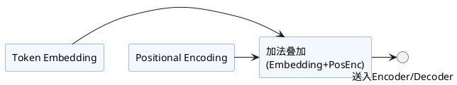

本文详细解析了Transformer结构在输入部分的关键实现，包括Token Embedding与Positional Encoding的原理与示例代码。该部分为后续多层Encoder/Decoder堆叠打下基础，帮助理解自注意力结构如何引入序列及位置信息。

Transformer 的输入部分主要处理**Token Embedding**和**Positional Encoding**。这两步为后续的多层Encoder/Decoder堆叠打下基础。下面介绍这两步的原理，并给出典型pytorch实现代码示例。

## 1. Token Embedding（输入嵌入）

将输入的token序列（如单词、子词）转换成高维稠密向量。通常使用一个 nn.Embedding 层。

**代码示例：**
```python
import torch
import torch.nn as nn

vocab_size = 10000  # 词表大小
d_model = 512       # 编码维度

# Token Embedding层
token_embedding = nn.Embedding(vocab_size, d_model)

# 假设输入token id序列
input_ids = torch.LongTensor([[1, 5, 23, 9, 0]])  # batch=1, seq_len=5
embedded = token_embedding(input_ids)  # shape: (batch, seq_len, d_model)
```


## 2. Positional Encoding（位置编码）

Transformer无循环，需显式注入位置信息。最常见的为**正弦-余弦位置编码**，如论文所示：

**实现代码：**
```python
import math

class PositionalEncoding(nn.Module):
    def __init__(self, d_model, max_len=5000):
        super().__init__()
        pe = torch.zeros(max_len, d_model)
        position = torch.arange(0, max_len, dtype=torch.float).unsqueeze(1)
        div_term = torch.exp(torch.arange(0, d_model, 2).float() * 
                             (-math.log(10000.0) / d_model))
        pe[:, 0::2] = torch.sin(position * div_term)
        pe[:, 1::2] = torch.cos(position * div_term)
        pe = pe.unsqueeze(0) # (1, max_len, d_model)
        self.register_buffer('pe', pe)

    def forward(self, x):
        # x shape: (batch, seq_len, d_model)
        x = x + self.pe[:, :x.size(1)]
        return x

# 调用
pos_encoder = PositionalEncoding(d_model)
encoded = pos_encoder(embedded)  # shape: (batch, seq_len, d_model)
```


## 3. 综合流程

整体输入部分——**Embedding + Positional Encoding**：

```python
def transformer_input(input_ids, vocab_size, d_model):
    token_embedding = nn.Embedding(vocab_size, d_model)
    pos_encoder = PositionalEncoding(d_model)
    embedded = token_embedding(input_ids)
    encoded = pos_encoder(embedded)
    return encoded  # shape: (batch, seq_len, d_model)
```


## 结构示意图




**小结：**  
Transformer 输入部分关键在于：`Token Embedding` + `Positional Encoding` 组合，为每个token提供了丰富的上下文和序列顺序信息，这是深层注意力机制建模序列关系的基础。


