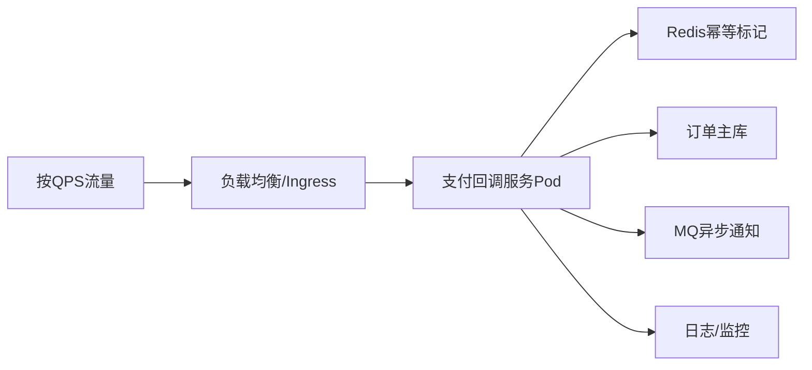

# 高并发支付回调服务

随着移动支付和电商的普及，支付系统成为业务系统最核心的部分之一。**高并发支付回调服务**的设计和实现，直接影响订单闭环速度、用户体验以及资金安全。本文介绍通用的高并发支付回调服务架构设计要点、常见痛点与优化实践，适用于 Go 及主流云原生栈。

---

## 一、业务与技术场景

- **典型场景**：第三方支付平台（如支付宝、微信支付）支付完成后，将回调商户服务，通知订单状态变更。
- **高并发挑战**：双十一大促、红包活动、团购拼单等瞬时流量暴增，需支撑数万~数十万 QPS 的请求高可靠达成。
- **主要目标**：高可用、幂等性、安全性（防刷单/重放）、处理链路短、易观测/追踪。

---

## 二、关键技术点

### 1. 幂等性设计

- 回调是**至少一次**语义，支付平台可能多次重试，必须保证**无论回调多少次，最终业务只处理一次**。
- 常见实现方式：
  - 数据库唯一约束（如 callback_id 唯一索引）。
  - 利用分布式缓存（如 Redis setnx）标记回调处理状态。
  - 乐观锁/版本号防止并发写冲突。

### 2. 高可用与扩展性

- **无状态服务**，可通过水平扩展支撑高并发。
- 请求流量可用云负载均衡、K8s Ingress 网关等进行分发。
- 服务和存储后端（如 DB、缓存）需提前压测瓶颈。

### 3. 数据一致性与短链路

- 回调逻辑建议精简，仅做状态变更、幂等校验与必要落库，其他耗时逻辑异步化（如通知下游、发券、推送）。
- 可通过事件驱动/消息队列（Kafka、RabbitMQ）削峰与解耦。

### 4. 安全校验

- 校验回调签名，防止伪造请求。
- 校验金额、订单号与业务合法性。
- 支持请求频率/来源限流，防止恶意刷单。

### 5. 观测与告警

- *每一次回调*都应该有详细日志（包含请求内容、处理状态）。
- 指标采集（QPS、延迟、失败率）、接入链路追踪（OpenTelemetry）、实时告警。

---

## 三、系统架构图



---

## 四、核心代码示例（Go Gin 框架）

```go
// 支付回调处理伪代码（Gin为例）
func PaymentCallback(c *gin.Context) {
    req := parseCallbackRequest(c)
    if !verifySignature(req) {
        c.JSON(400, gin.H{"status": "invalid signature"})
        return
    }
    // 幂等性校验 (以Redis为例)
    idempotentKey := fmt.Sprintf("callback:%s", req.OrderID)
    set, err := redisClient.SetNX(context.Background(), idempotentKey, "1", 5*time.Minute).Result()
    if err != nil || !set {
        // 已处理过
        c.JSON(200, gin.H{"status": "ok"})
        return
    }

    // 更新订单状态（落库）
    err = UpdateOrderStatus(req.OrderID, "PAID")
    if err != nil {
        // 回滚幂等Key
        redisClient.Del(context.Background(), idempotentKey)
        c.JSON(500, gin.H{"status": "fail"})
        return
    }

    // 发布异步事件
    mqClient.Publish("order-paid", req.ToEvent())

    c.JSON(200, gin.H{"status": "ok"})
}
```

---

## 五、常见问题与优化

- **数据库瓶颈**：热点订单写入，优化 SQL & 推荐行锁+唯一约束。
- **Redis 压力大**：开启集群/分片，使用短 TTL 防雪崩。
- **回调下游耗时长**：主流程只做状态变更，其他全部异步。
- **高并发安全**：签名校验，频率限制，日志留证。

---

## 六、推荐技术栈

- Web 框架：Gin/Echo/Fiber（Go）
- Idempotent/分布式锁：Redis、etcd
- DB：MySQL/PostgreSQL（支持唯一索引、行锁）
- MQ：Kafka/RabbitMQ/NSQ
- 观测：Prometheus/Grafana、OpenTelemetry
- 云原生平台：Kubernetes

---

## 七、总结

高并发支付回调服务的本质是**幂等+安全+高可用+易扩展**。建议采用云原生架构、精简主链路、充分监控观测、增强自恢复能力来获得高可靠的财务数据闭环能力。

如需具体代码模板/详细压测指导，可进一步补充需求。


构建一个**高并发支付回调服务**（如接收支付宝、微信、银联等第三方支付平台的异步通知）是典型的高可靠、低延迟、强幂等性要求的场景。结合你的背景（熟悉 Go、云原生、K8s、性能调优），以下是**完整的技术选型、架构设计和关键实现要点**，适用于 2025 年生产环境。

---

## 一、核心需求分析

| 维度 | 要求 |
|------|------|
| **并发量** | 高（可能瞬时数千~数万 QPS） |
| **可靠性** | 必须 100% 接收并处理回调，不能丢消息 |
| **幂等性** | 同一订单多次回调必须只处理一次 |
| **响应速度** | 第三方通常要求 1s 内返回 `200 OK`，否则会重试 |
| **可追溯性** | 所有回调需记录原始请求、处理状态、重试日志 |
| **安全性** | 验签（防止伪造回调）、防刷、防重放攻击 |

---

## 二、推荐技术栈（Go 为中心）

### 1. **Web 框架：Gin or Hertz**
- **首选：Hertz**（字节开源，基于 CloudWeGo）
  - 性能优于 Gin（基于自研 netpoll，非标准 net/http）
  - 内置中间件：超时控制、限流、熔断、OpenTelemetry
  - 更适合高并发网关类服务
- **备选：Gin**
  - 如果团队已熟悉 Gin，可通过优化达到类似效果
  - 需手动集成限流、优雅关闭等

> ✅ **建议**：新项目直接用 **Hertz**；已有 Gin 体系可优化后继续用。

### 2. **消息队列：Kafka / Pulsar / RocketMQ**
- **作用**：将“接收回调”和“业务处理”解耦
- **流程**：
  ```text
  第三方回调 → Web 服务（快速 ACK） → 写入 MQ → 异步消费处理业务
  ```
- **选型建议**：
  - **Kafka**：生态成熟，适合高吞吐（国内大厂常用）
  - **Pulsar**：多租户、分层存储，适合长期日志留存
  - **RocketMQ**：阿里系，事务消息支持好（国内金融场景多）

> ⚠️ **不要直接在 HTTP handler 里处理复杂业务**（如更新订单、发券、通知用户）！

### 3. **数据库**
- **主库（业务状态）**：MySQL（InnoDB）
  - 建议使用 **GORM** 或 **Ent**（类型安全）
- **幂等表**：单独建 `payment_callback_idempotent` 表
  ```sql
  CREATE TABLE payment_callback_idempotent (
    out_trade_no VARCHAR(64) PRIMARY KEY,  -- 商户订单号（唯一）
    trade_no VARCHAR(64),                  -- 支付宝/微信交易号
    status TINYINT,                        -- 0: pending, 1: processed
    created_at TIMESTAMP,
    updated_at TIMESTAMP
  ) ENGINE=InnoDB;
  ```
- **缓存（可选加速幂等检查）**：Redis
  - 用 `SET out_trade_no EX 86400 NX` 实现快速幂等（注意与 DB 双写一致性）

### 4. **可观测性**
- **日志**：`log/slog` + 结构化输出（JSON）
- **指标**：Prometheus（暴露回调 QPS、失败率、处理延迟）
- **链路追踪**：OpenTelemetry + Jaeger（追踪从回调到业务处理全链路）

### 5. **部署与弹性**
- **K8s 部署**：HPA 基于 CPU/内存 或 自定义指标（如 Kafka lag）
- **Service Mesh**：Istio 可做入口限流、mTLS（可选）
- **自动扩缩容**：配合 KEDA（基于 Kafka 消费积压自动扩缩）

---

## 三、关键实现细节

### 1. **快速 ACK + 异步处理**
```go
// Hertz/Gin handler 示例
func HandleAlipayCallback(c context.Context, ctx *hertz.Ctx) {
    // 1. 立即解析原始 body（用于验签和幂等）
    body := ctx.Body()

    // 2. 快速验签（使用支付宝公钥）
    if !verifySignature(body, alipayPublicKey) {
        ctx.JSON(400, "invalid signature")
        return
    }

    // 3. 幂等检查（先查 Redis，再查 DB）
    outTradeNo := extractOutTradeNo(body)
    if isProcessed(outTradeNo) {
        ctx.String(200, "success") // 已处理，直接返回
        return
    }

    // 4. 入 MQ（非阻塞）
    if err := kafkaProducer.SendAsync("payment-callbacks", body); err != nil {
        // 入队失败 → 记录告警，但依然返回 200（避免第三方重试风暴）
        log.Error("Kafka send failed", "err", err)
        // 可选：写入本地磁盘队列兜底
    }

    // 5. 立即返回 200（必须在 1s 内！）
    ctx.String(200, "success")
}
```

### 2. **幂等性实现（双重保障）**
- **第一层：Redis SET NX**（高性能）
- **第二层：DB 唯一键 + 乐观锁**
  ```go
  // 消费者处理逻辑
  tx := db.Begin()
  var record IdempotentRecord
  if tx.Where("out_trade_no = ?", no).First(&record).RowsAffected == 0 {
      // 插入幂等记录
      tx.Create(&IdempotentRecord{OutTradeNo: no, Status: 0})
  } else if record.Status == 1 {
      tx.Rollback()
      return // 已处理
  }
  // 执行业务逻辑...
  tx.Model(&record).Update("status", 1)
  tx.Commit()
  ```

### 3. **限流与防刷**
- **入口限流**：Hertz 内置 `sliding window` 限流，按 IP 或商户 ID
- **异常检测**：同一订单 1 分钟内回调 >5 次 → 告警 + 人工介入

### 4. **优雅关闭（避免丢消息）**
- HTTP 服务：监听 `SIGTERM`，停止接收新请求，等待处理中连接完成
- Kafka 消费者：提交 offset 后再退出
- 使用 `context.WithTimeout` 控制单次处理最大时间

---

## 四、性能优化建议

| 优化点 | 方案 |
|-------|------|
| **减少 GC** | 复用 buffer（sync.Pool）、避免频繁 string 转换 |
| **连接复用** | DB 连接池、Kafka producer 复用 |
| **异步日志** | 使用 zap/zapcore 异步写入 |
| **CPU 绑核** | 在 K8s 中设置 CPU manager policy（可选） |

---

## 五、监控告警关键指标

| 指标 | 告警阈值 |
|------|--------|
| 回调 HTTP 5xx 率 | > 0.1% |
| Kafka 消费延迟 | > 30s |
| 幂等表冲突率 | > 5%（可能业务异常） |
| 单订单回调次数 | > 10 次/小时 |

---

## 六、总结：架构图

```
[支付宝/微信] 
     ↓ HTTPS
[Ingress / SLB]
     ↓
[Hertz/Gin 服务] → 快速验签 + 幂等检查 + 入 Kafka → 返回 200
     ↓
[Kafka]
     ↓
[异步消费者] → 幂等校验 → 更新订单 → 发通知 → 标记完成
     ↓
[MySQL + Redis]
```

---

✅ **最终建议**：
- **框架**：新项目用 **Hertz**，已有 Gin 可优化。
- **核心原则**：**接收快、处理异步、幂等强、可追溯**。
- **不要**在 HTTP handler 里做 DB 事务、发 HTTP 请求、sleep 等耗时操作。

具体代码模板（如 Hertz 回调 handler + Kafka producer + 消费者）。